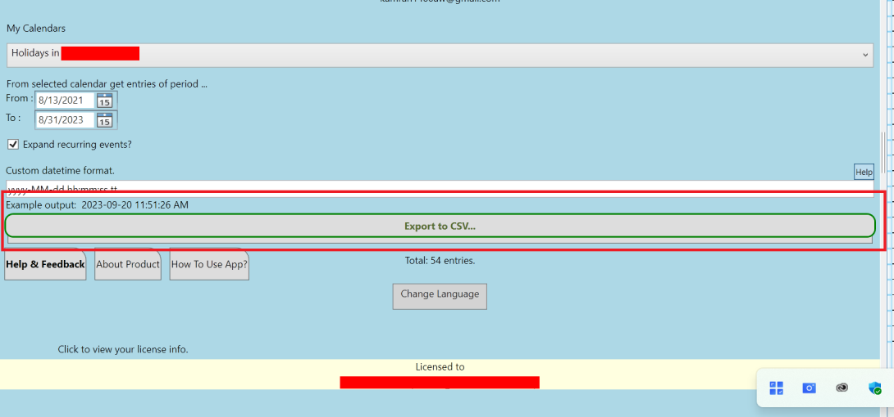

# Export Your G-Calendar Test Report

This task requires Testers follow the Testing Procecure and Reporting guidance here: [README.md](README.md).

# Guidance

F&CO's app "Export Your G-Calendar" (EGC) (see webpage: [https://freytag.us/export-google-calendar](https://freytag.us/export-google-calendar)) test results are reported here.

Every feature of the app needs to be tried multiple times various ways in an effort to break it.  If something is unclear or doesn't work as you expect we want to know: 

1. what you did *exactly* to create the issue, 
2. what you expected the app to do, and 
3. what actually happened - with screenshots of the issue.  
4. We also need to know the start and end times of the debugging session so we can look at what our backend system reports to make sure it is working properly.  

The usual version of EGC linked to from the website is *NOT* the version to be tested (though it is similar).  To Test EGC you must have [established a Tester relationship](README.md) with F&CO.  After that F&CO will ahve configured the Microsoft Store to grant you _specifically_ permission to download the latest version of EGC.  That permissions grant must be to an email address registered with, and used to log into, a copy of Windows 10 or Windows 11.  Our software is downloaded from the Microsoft Store hence the need for the valid Windows 10/11 login email address.  Your specific Microsoft Store email address will allow you, and only you, to be able to download the Tester version of EGC.

NOTE: do not be confused by EGC's several names in various documents:

- Google Calendar
- Google Calendar - Microsoft Edition
- Export Google Calendar
- Export Your Google Calendar

... they are all the same EGC whose name has been changed because Microsoft and Google have changed their naming rules over time.

# How To Do Testing

## Before Starting

We need:

1. your Windows 10 or Windows 11 email address to grant you access and
2. the fee you would require for the test.

Please pull down the older version of EGC and use its feature set to determine how much work it would take to test with screenshots.  Then please tell us the total cost for completing this task.  Thank you.

_Please do not pay for our app.  That would actually ruin the test._

The Test EGC is similar to the EGC already in the store so you can look at that app to see roughly how complicated the task will be.

*Do not start this task until:*

1. we have your email address,
2. agreed to your fee, and
3. agreed to a delivery date.

## Reporting Results

We need test reports that give screenshots with explanations of what was done to reproduce the bug along with screenshots.  _Our being able to reproduce bugs is a condition of report acceptance._

1. Clone this repository to your github account and
  * insert your results to ExportYourGoogleCalendar.md, following the example for previous tests, at the bottom of this document in [GitHub Markdown](https://github.com/adam-p/markdown-here/wiki/Markdown-Cheatsheet).
2. It will almost always be necessary to insert a picture to explain the bug setup and end conditions.  Put this picture in a folder in the same repository as the markdown file outlining your tests (see the [markdown guide](https://github.com/adam-p/markdown-here/wiki/Markdown-Cheatsheet) for the corrrect syntax).
3. To submit your report (edits to this repo with screenshots) issue to pull request addressed to 'fandco-public'.  
   
Follow the example of previous tests seen in the *Tests and Results* section below when reporting your results.

The report will be in markdown (*.md) format and will consist of:

* bug setup condition and
* failure condition screenshots,
* with text explaining how to reproduce the bug.  

_Please only document the setup conditions and result that is considered a bug with a screenshots of the setup and result.  Bugs include behavior you did not expect, so open to your professional judgement._

Remember to *cover up all personal information in your submitted screenshots* leaving only the information needed to understand and reproduce the reported bug.

You may use markdown editors such as [Typhora](https://typora.io/) to produce your report.

## Goal

The detailed delivery requirements are [here](README.md).  This is simply that introductory description we gave you during negotation so you don't need to dig through prior messages.

We want a test of: https://apps.microsoft.com/store/detail/export-your-gcalendar/9PNSMQ2SW74K

This will be be a test of of a Win10/11 desktop app "Export Your Google Calendar" (EGC) downloaded from the Microsoft Store from a special package flight only available to you (and other testers, this is why we need the email address you use when buying from the Microsoft Store).  This download will be tied to your Outlook/Hotmail email address that you use to buy things in the Microsoft Store.  You will not be expected to buy something but you will need to use this email to download the free app and the free 'test' addons in the app.  

The report will be public and delivered on GitHub.  Public bug reports show our customers the app is actively maintained and _give you, the Tester, a public example of your work._

The full test will use every feature multiple times with multiple types of data.  Bug are not only explicit exceptions and crashes but also point where the app seems confusing to the tester in their professional opinion.

# Tests and Results

## Jakdevelop1 - 20230920

### BUG: 000001

The application "Export Your Google Calendar" (ECG) was tested multiple times with different screen interactions and input. However, the application behaves perfectly normally for all features except for one part. The "Change Language" feature is not working as it should work for a normal user. After opening the application, the system asks the user to sign in with email and password to import contacts as shown in the below screenshot # 1.

On the main screen, the user clicks on "Change Language" and the application shows different available languages for translation as shown in screenshot # 2.

After selecting a language (for eg; Arabic), the application asks the user to sign in again as shown in screenshot # 3. Instead, the application should translate without asking the user to sign in every time the user changes the language. After the change in language, the user has to do all the steps again like allowing contacts permissions to the application. (which was already done in start after sign in as shown in screenshot # 4) 

#### ANSWER

When language button is clicked pop-up warning to user that changing the language will lose the user's unsaved work.

## kamran1400aw - 20230918

### BUG: 000002 (GitHub Issue:1)

Submit Button is hidden behind the Export to CSV button. When users are in normal full-screen view they can't even see if there is a button there but if they drag the right panel toward the right side only then they know there is a button behind Export to CSV. This button should be placed either on top of Export to CSV or at the very bottom.

#### ANSWER

The stackframe holding the bottom buttons should not be able to compress the frame/buttons above it when the app window bottom is moved upwards.  The whole app window should refuse to continue to compress beyond the point where content becomes hidden.  

### BUG: 000003 (GitHub Issue:2)

USers are able to pick the custom date formate first time without any issue but when they user the app and tries to change it. It doesn't work. Only way for users to change is either reset or close application and reopens every thing.

#### ANSWER

NONE as of yet

### BUG: 000004 (GitHub Issue:3)

The total Entries label is hidden behind the Help & Feedback, About Product, and How to use app buttons. These three buttons should be moved slight down!

#### ANSWER

Change UI so compressing the app window stops at the point screen elements (including collapsed/hidden elements) might become obscured.

### BUG: 000005 (GitHub Issue:4)

When a user clicks on the change language option and selects any language. It logout users and then users have to signing once again to see the changes.

#### Answer

When language button is clicked pop-up warning to user that changing the language will lose the user's unsaved work.

### BUG: 000006 (Button Text Need Space Issue: 5
- Help & Feedback, About Product and How to use the app? buttons need a few fixes. First of all the button width and height are fixed compared to the other buttons on the app.
  
- Secondly, there is no space before and after the test within the button as you can see it's almost touching the edges.
  
- The third Button design on the app is changing and All button designs should be Uniform throughout the application. Currently, on one page we can see Round edges buttons, Straight edges buttons, and buttons that have both round and straight edges.
  
- Help & Feedback button fonts are bold where as the other two buttons are not bold.

