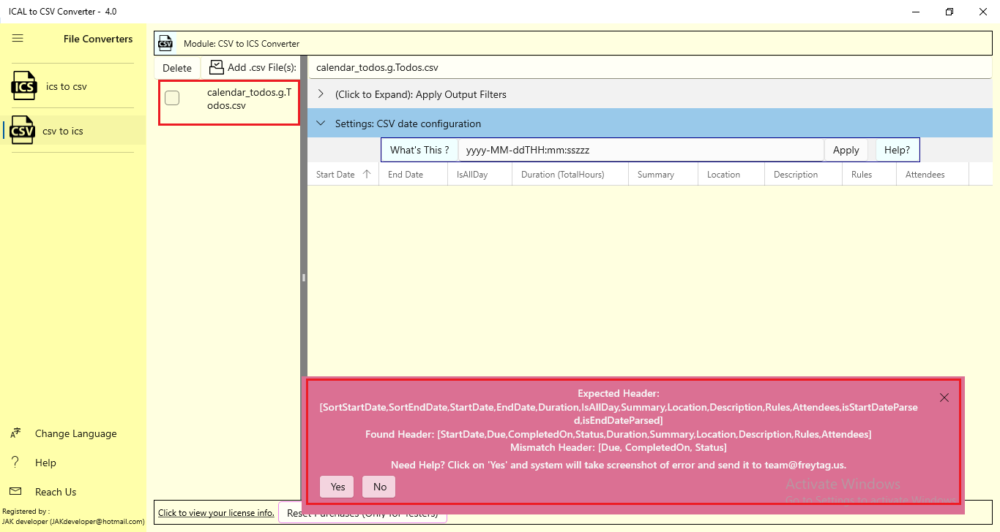
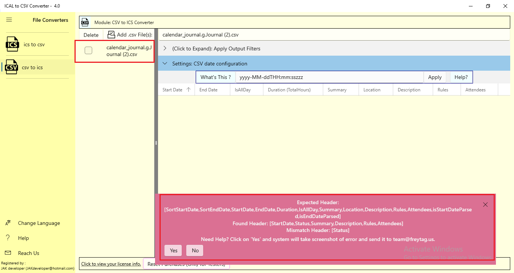
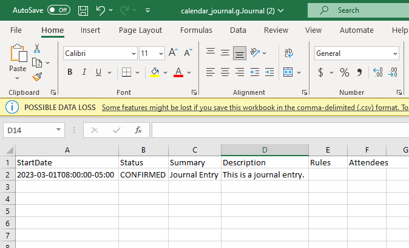
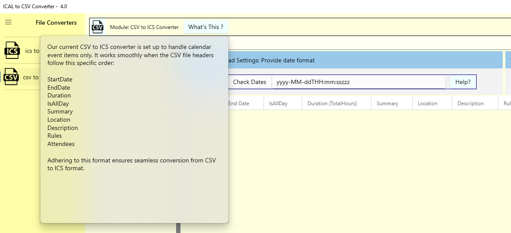
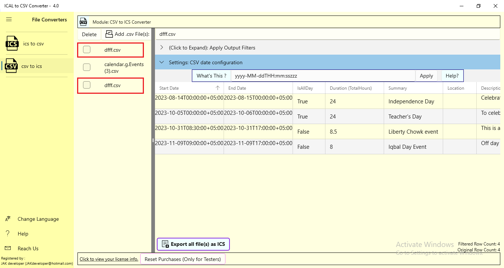
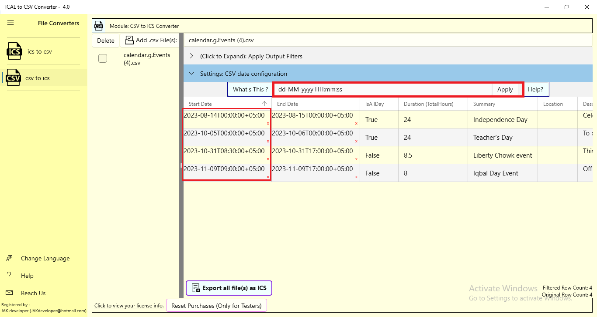
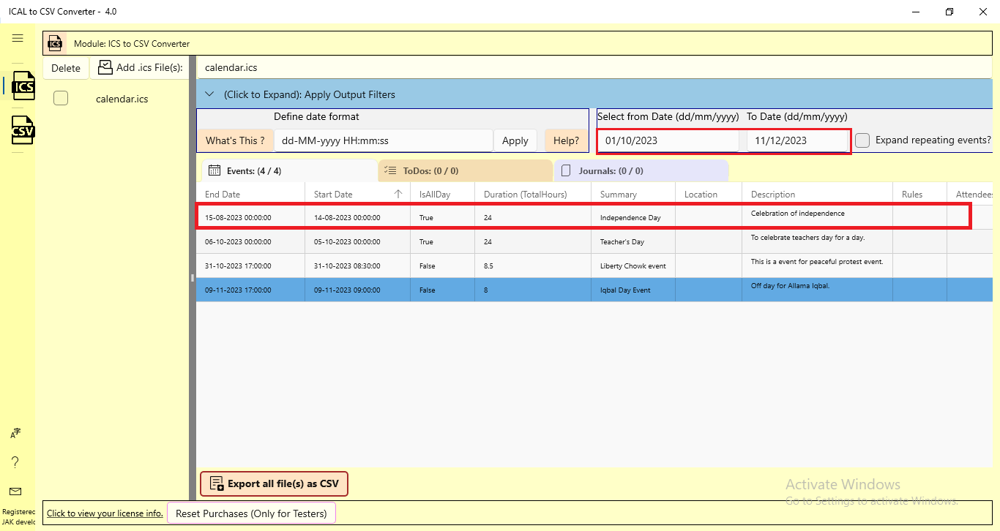

# ICAL to CSV Converter Test Report

This task requires Testers follow the Testing Procecure and Reporting guidance here: [README.md](README.md).

# Guidance

F&CO's app "ICAL to CSV Converter" (ICAL) (see webpage: [https://freytag.us/ical-to-csv-converter](https://freytag.us/ical-to-csv-converter)) test results are reported here.

We are particularly concerned that user's data be convertered fully and accurately.  This means that ICS data must be fully and accurately be converted to four respective.  The minimum of data types of concern are: 

- Events
- TODOs
- Journal
- Busy/Free, and 
- Recurring versions of all of the above. 

This means creating the ICS data files, probably in your calendaring program, and exporting it.  We will need your ICS and CSV data to reproduce any bugs you find.  NOTE, when you create CSV files try using the CSV to ICS converter to see if the data makes the round-trip accurately.  

Secondarily we want every feature of the app to be tried multiple times various ways in an effort to break it.  If something is unclear or doesn't work as you expect we want to know: 

1. what you did *exactly* to create the issue, 
2. what you expected the app to do, and 
3. what actually happened - with screenshots of the issue.  
4. We also need to know the start and end times of the debugging session so we can look at what our backend system reports to make sure it is working properly.  

The usual version of ICAL linked to from the website is *NOT* the version to be tested (though it is similar).  To Test EGC you must have [established a Tester relationship](README.md) with F&CO.  After that F&CO will ahve configured the Microsoft Store to grant you _specifically_ permission to download the latest version of EGC.  That permissions grant must be to an email address registered with, and used to log into, a copy of Windows 10 or Windows 11.  Our software is downloaded from the Microsoft Store hence the need for the valid Windows 10/11 login email address.  Your specific Microsoft Store email address will allow you, and only you, to be able to download the Tester version of EGC.

NOTE: do not be confused by ICAL's several names in various documents.  They are all the same ICAL whose name has been changed because Microsoft has changed their naming rules over time.

# How To Do Testing

## Before Starting

We need:

1. your Windows 10 or Windows 11 email address to grant you access and
2. the fee you would require for the test.

Please pull down the older version of EGC and use its feature set to determine how much work it would take to test with screenshots.  Then please tell us the total cost for completing this task.  Thank you.

_Please do not pay for our app.  That would actually ruin the test._

The Test EGC is similar to the EGC already in the store so you can look at that app to see roughly how complicated the task will be.

*Do not start this task until:*

1. we have your email address,
2. agreed to your fee, and
3. agreed to a delivery date.

## Reporting Results

We need test reports that give screenshots with explanations of what was done to reproduce the bug along with screenshots.  _Our being able to reproduce bugs is a condition of report acceptance._  Please also include in this repo any ICAL or CSV files you used to generate your results.

1. Clone this repository to your github account and
  * insert your results to ICALtoCSVConverter.md, following the example for previous tests, at the bottom of this document in [GitHub Markdown](https://github.com/adam-p/markdown-here/wiki/Markdown-Cheatsheet).
2. It will almost always be necessary to insert a picture to explain the bug setup and end conditions.  Put this picture in a folder in the same repository as the markdown file outlining your tests (see the [markdown guide](https://github.com/adam-p/markdown-here/wiki/Markdown-Cheatsheet) for the corrrect syntax).
3. To submit your report (edits to this repo with screenshots) issue to pull request addressed to 'fandco-public'.  
   

Follow the example of previous tests seen in the *Tests and Results* section below when reporting your results.

The report will be in markdown (*.md) format and will consist of:

* bug setup condition and
* failure condition screenshots,
* with text explaining how to reproduce the bug.  

_Please only document the setup conditions and result that is considered a bug with a screenshots of the setup and result.  Bugs include behavior you did not expect, so open to your professional judgement._

Remember to *cover up all personal information in your submitted screenshots* leaving only the information needed to understand and reproduce the reported bug.

You may use markdown editors such as [Typhora](https://typora.io/) to produce your report.

## Goal

The detailed delivery requirements are [here](README.md).  This is simply that introductory description we gave you during negotation so you don't need to dig through prior messages.

We want a test of: https://apps.microsoft.com/detail/ical-to-csv-converter/9P801WD6F1VZ

This will be be a test of of a Win10/11 desktop app "Export Your Google Calendar" (EGC) downloaded from the Microsoft Store from a special package flight only available to you (and other testers, this is why we need the email address you use when buying from the Microsoft Store).  This download will be tied to your Outlook/Hotmail email address that you use to buy things in the Microsoft Store.  You will not be expected to buy something but you will need to use this email to download the free app and the free 'test' addons in the app.  

The report will be public and delivered on GitHub.  Public bug reports show our customers the app is actively maintained and _give you, the Tester, a public example of your work._

The full test will use every feature multiple times with multiple types of data.  Bug are not only explicit exceptions and crashes but also point where the app seems confusing to the tester in their professional opinion.

# Tests and Results

## Tests by rfreytag

### BUG 000020

The ICS-to-CSV Apply button should read 'Reformat Date'.

#### ANSWER

Fix made.

### BUG 000019

The CSV-to-ICS Apply button should read 'Check Dates'.

#### ANSWER

Fix made.

### BUG 000018

In the date boxes the 'X' should clear the date not just delete the date from right-to-left.

#### ANSWER

The 'X' is defined by the control and not customizable.

### BUG 000017

When a *.ics or *.csv file is 'Unload'-ed then it should no longer appear in the tabular window to the right. The window should be empty until another file is selected.

#### ANSWER

Fix made.

### BUG 000016

When loading a CSV file with a date format that doesn't match the date format in the 'Apply' box an error is thrown. Instead, an error should only be thrown when none of the allowed date formats match the format of t\
he loaded data.

#### ANSWER

In csv-to-ics code has been added to show error message on 'apply' button.  But error has to be shown if parser fails to parse any date in any row.

### BUG 000015

Change 'Delete' to 'Unload' on all the interfaces so that users don't get the wrong idea that 'Delete'-ing a loaded file does anything other than unloading the file from the ICAL app while leaving the file itself on \
the filesystem.

#### ANSWER

Fix made.

### BUG 000014

In the ICS to CSV pane, clicking the 'Apply' button without a date range produces an unhandled exception. It should produce a handled exception.

#### ANSWER

This bug cannot be reproduced.

### BUG 000013

The ICS-to-CSV Apply button should read 'Reformat Date'.

#### ANSWER

Fix Made

### BUG 000012

The CSV-to-ICS Apply button should read 'Check Dates'.

#### ANSWER

Fix Made

### BUG 000011

In the date boxes the 'X' should clear the date not just delete the date from right-to-left.

#### ANSWER

The 'X' is defined by the control and not customizable.

### BUG 000010

When a *.ics or *.csv file is 'Unload'-ed then it should no longer appear in the tabular window to right.  The window should be empty until another file is selected.

#### ANSWER

Fix made.

### BUG 000009

When loading a CSV file with a date format that doesn't match the date format in the 'Apply' box an error is thrown.
Instead, an error should only be thrown when none of the allowed date formats match the format of the loaded data.

#### ANSWER

The expected behavior is that if any dates do not match, it indicates an incorrect date format, rendering the file incompatible with conversion to ICS. The 'x' mark at the bottom right corner of the data grid serves as a visual cue for the user, highlighting the specific record where the date does not align with the specified format.

### BUG 000008

Change 'Delete' to 'Unload' on all the interfaces so that users don't get the wrong idea that 'Delete'-ing a loaded file does anything other than unloading the file from the ICAL app while leaving the file itself on the filesystem.

#### ANSWER

Fix made.

### BUG 000007

In the ICS to CSV pain, clicking the 'Apply' button without a date range produces an unhandled exception. It should produce a handled exception.

#### ANSWER

Fix made.

### BUG 000006

If ICS-to-CSV is given a date range the events with dates matching the _end_ date are _not_ included. 

#### ANSWER

Fix made.

## Tests by Jakdeveloper1

### BUG 000005:

Same issue with the .ics (ToDos) file: Once you have converted the .ics (ToDos) file to the .csv file. The resultant .csv file is then uploaded to the system, which shows the error message of "mismatch header" status.

[calendar_todos.g.Todos.csv](ICALtoCSVConverter_test_data/calendar_todos.g.Todos.csv)

#### ANSWER

Currently our  CSV to ICS converter only supports converting of calendar events items only.  It expects specific header related to calendar events in csv file.   Anything else will throw exception.

### Bug 000004:

Once you have converted the .ics (journal) file to the .csv file. The resultant .csv file is then uploaded to the system, which shows the error message of "mismatch header" status. To further add to the information, the resultant .csv file is converted successfully in the previous step and shows correct data inside the file after conversion. So, there is no issue in the converted .csv file (Screenshot is attached). 

... and ...

[calendar_journal.g.Journal(2).csv](ICALtoCSVConverter_test_data/calendar_journal.g.Journal2.csv)

#### ANSWER

Currently our  CSV to ICS converter only supports converting of calendar events items only.  It expects specific header related to calendar events in csv file.   Anything else will throw exception.
Enduser also is likely to misunderstand this behavior so a new "What's This?" button is inserted on top (see screenshot below).

### Bug 000003:

Multiple instances of the same file can be uploaded to the "ICAL to CSV converter" application. About the below screenshot, the file named "diff.csv" can be seen as uploaded multiple times to be converted from .csv to .ics format.

#### ANSWER

We allow the user to select and upload the same file multiple times, it's his choice, however system will handle it without issue.
Enduser also is likely to misunderstand this behavior so a new "What's This?" button is inserted on top (see screenshot below).

### Bug 000002:

After converting the file from .ics to .cvs. The same file is re-uploaded to the ".csv to .ics" section. Apply different date-time formats to the file results (rows), and you can see the incorrect format is applied to the resultant "Start Date/End Date" columns as shown in the screenshot below.

[calendar.g.Events.csv](ICALtoCSVConverter_test_data/calendar.g.Events.csv)

#### ANSWER

In the CSV-to-ICS module, unlike in the ICS-to-CSV module, we have to specify input date format and not the output date format.  The 'red x' appears next to dates that do not match the input date format.  
The input date format is specified in the 'Apply' box.  

### BUG 000001

At the time of converting a recurrent event file from ".ics to .csv". Apply the date filter to the result (rows) as shown in the screenshot below. The filter applied is "Select from Date (dd/mm/yyyy)" is 01/10/2023 and "To Date (dd/mm/yyyy)" is 11/12/2023. 
After applying that filter, the first row (highlighted) should be filtered out of the current results, but it is showing incorrect results.

[calender.ics](ICALtoCSVConverter_test_data/calendar.ics)

#### ANSWER

*Failed to reproduce* in this tester commit: 7f72d28.  Perhaps the 'Apply' button was not clicked?  Moved the 'Apply' button closer to the date fields in hopes it is not missed.  
_Reproduced in commit 859c14f1,_ the problem might be that the default 'Start Date' and 'End Date' display format is yyyy-MM-dd while the filter is dd-MM-yyyy.  The default filter format is changed to yyyy-MM-dd to avoid this problem.  
Fixed in commit ba5466b.

